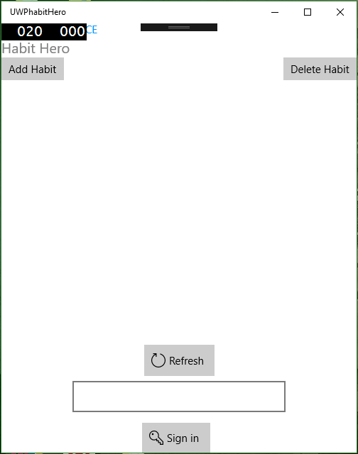

# Mobile Applictions Development 4th Year Assignment
## Habit Hero
### Alan Murphy G00312295

## Overview
I set out to create a Universal Windows Application. My app Idea is based around bad habits and tracking them and being able to handle them. The App is explained below. To develop this app I used alot of techniques learnt in our labs throughout the semester and I also used msdns documentation on technologies I used in this app.

The app uses aspects of:
+Azure Mobile App Service (Authentication, Cloud Storage)
+MVVM
+Observable Collections
+Async - Await.

## User Guide
The user will be greeted with a simple and clean layout when the start the app. Here the user must first sign in using the sign in button or else the user will be told they are not authorised to use the app.

Anyone can sign into the app using their facebook login details. Once the deatails are entered users are free to use all features of the app.

If the user preses the "Add Habit button" the will be redirected to a form which will allow him to add the following details of thier habit.
+The name of the habit
+How bad they think their habit it on a scale of 10
+And the reason they want to quit

The save button then adds the habit to a list view on the main page and the exit button clears the text in the text boxes and returns the users to the mmain page of the app.

THe list view containing details of your habit

The user can then create a Todo list item using the textbox and the bottom of the app and can click add to add the item to the listview, when they have completed the task they can tick the checkbox to remove it from the list.

